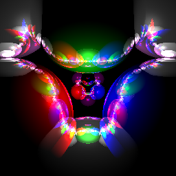

# Lights-Up
This assignment you now will lighting, material properties and along the way spheres in addition to polygonal 3D models. Also, unlike before, in this assignment you will be asked to create specifications for scenes of your own design and then demonstrate that your ray casting system is capable of rendering these scenes.

## 3. Process

## 4. My Final Rendered Image:
